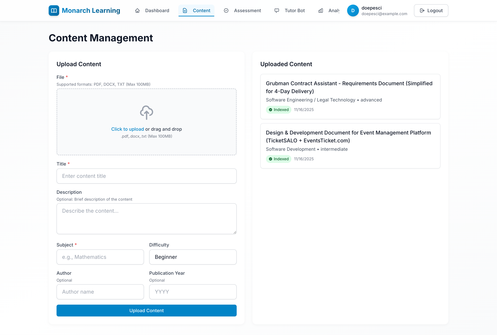
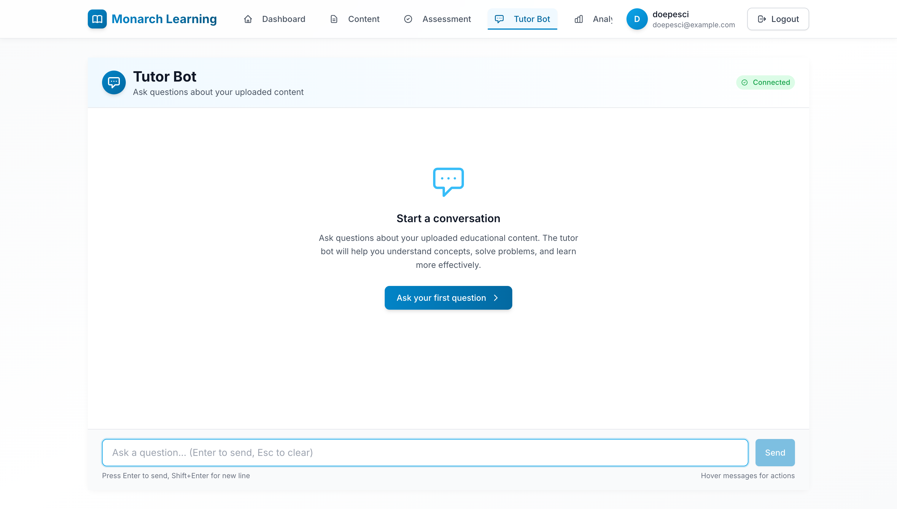

# 🎓 Monarch Learning Platform

<div align="center">


**AI-powered personalized learning and tutoring system with Gemini File Search integration**

[Features](#-features) • [Quick Start](#-quick-start) • [Documentation](#-documentation) • [Contributing](#-contributing)

</div>

---

## 📸 Screenshots

<div align="center">

### Dashboard

*Personalized dashboard with progress tracking, subject performance charts, and quick actions*

### Content Management

*Upload and manage educational content with AI-powered metadata extraction and indexing status*

### Assessment Generation

*AI-generated assessments based on uploaded content with real-time generation progress*

### Tutor Bot

*Real-time AI tutor with file search integration, WebSocket connection status, and citation support*

### Analytics

*Comprehensive analytics dashboard with interactive charts, score distribution, and performance trends*

</div>

---

## ✨ Features

### 🎯 Core Features

- **📚 Content Management**
  - Upload PDF, DOCX, and TXT files
  - In-browser preview for PDF and DOCX files
  - AI-powered metadata extraction (subject, difficulty, author, etc.)
  - Drag-and-drop file upload interface
  - Real-time upload progress indicators

- **🔍 Gemini File Search Integration**
  - Advanced RAG-powered content indexing
  - Semantic search across uploaded documents
  - Automatic file indexing with metadata filtering
  - Citation support in AI responses

- **🎓 Student Profiles & Progress**
  - Comprehensive student profile management
  - Learning style preferences (visual, auditory, reading)
  - Grade level tracking
  - Knowledge gap identification
  - Performance analytics

- **📝 AI-Powered Assessments**
  - Generate personalized assessments from uploaded content
  - Multiple-choice questions with explanations
  - Content-only generation (no general knowledge)
  - Subject and topic-based filtering
  - Score tracking and analytics

- **🤖 RAG-Powered Tutor Bot**
  - Real-time AI tutor with WebSocket support
  - File search integration for accurate answers
  - Citation display for source material
  - Conversation history
  - Typing indicators and connection status

- **📊 Analytics Dashboard**
  - Interactive charts with Nivo (bar, line, pie charts)
  - Subject performance tracking
  - Progress visualization
  - Engagement metrics
  - Assessment history

- **🔐 Authentication & Security**
  - JWT-based authentication
  - Secure password validation (12+ characters)
  - CSRF protection
  - Enhanced security headers
  - Role-based access control

### 🛠️ Developer Features

- **Modern Tech Stack**
  - Django 5.0 with REST Framework
  - Next.js 14 with App Router
  - TypeScript for type safety
  - Tailwind CSS for styling
  - Zustand for state management

- **Code Quality Tools**
  - Ruff (ultra-fast linter and formatter)
  - mypy for type checking
  - ESLint and Prettier
  - Comprehensive test suite

- **Performance Optimizations**
  - Django ORM optimizations (select_related, prefetch_related)
  - Custom model managers
  - Database indexing
  - Efficient query patterns

---

## 🚀 Quick Start

### Prerequisites

- **Python** 3.10 or higher
- **Node.js** 18 or higher
- **PostgreSQL** (Neon recommended)
- **Redis** (for Celery and caching)
- **Google Gemini API Key** ([Get one here](https://makersuite.google.com/app/apikey))

### One-Command Setup

```bash
# Clone the repository
git clone https://github.com/bantoinese83/Monarch-Learning-Platform.git
cd monarch-learning

# Install all dependencies
make install

# Setup environment and database
make setup

# Start all services
make start
```

That's it! Your platform is now running at:
- **Frontend**: http://localhost:3000
- **Backend API**: http://localhost:8000
- **Admin Panel**: http://localhost:8000/admin

---

## 📖 Detailed Setup

### 1. Environment Configuration

#### Backend Environment (`backend/.env`)

Create `backend/.env` with the following variables:

```bash
# Django Settings
SECRET_KEY=your-secret-key-here-generate-with-openssl-rand-hex-32
DEBUG=True
ALLOWED_HOSTS=localhost,127.0.0.1

# Database (Neon PostgreSQL)
DB_NAME=your-database-name
DB_USER=your-database-user
DB_PASSWORD=your-database-password
DB_HOST=your-neon-host.neon.tech
DB_PORT=5432

# Gemini AI
GEMINI_API_KEY=your-gemini-api-key
GEMINI_MODEL=gemini-2.5-flash

# Redis
REDIS_HOST=localhost
REDIS_PORT=6379
CELERY_BROKER_URL=redis://localhost:6379/0
CELERY_RESULT_BACKEND=redis://localhost:6379/0

# Optional: Email (for production)
EMAIL_HOST=smtp.gmail.com
EMAIL_PORT=587
EMAIL_USE_TLS=True
EMAIL_HOST_USER=your-email@gmail.com
EMAIL_HOST_PASSWORD=your-app-password
```

#### Frontend Environment (`frontend/.env.local`)

Create `frontend/.env.local`:

```bash
NEXT_PUBLIC_API_URL=http://localhost:8000
```

### 2. Database Setup

#### Using Neon (Recommended)

1. Create a [Neon account](https://neon.tech)
2. Create a new project
3. Copy the connection string
4. Update `backend/.env` with your database credentials

#### Using Local PostgreSQL

```bash
# Install PostgreSQL
brew install postgresql  # macOS
# or
sudo apt-get install postgresql  # Ubuntu

# Create database
createdb monarch_learning

# Update backend/.env with local credentials
```

### 3. Redis Setup

#### macOS (Homebrew)

```bash
brew install redis
brew services start redis
```

#### Ubuntu/Debian

```bash
sudo apt-get install redis-server
sudo systemctl start redis
```

#### Docker (Alternative)

```bash
docker run -d -p 6379:6379 redis:alpine
```

### 4. Install Dependencies

```bash
# Install all dependencies (backend + frontend)
make install

# Or manually:
# Backend
cd backend
python3 -m venv venv
source venv/bin/activate
pip install --upgrade pip
pip install -r requirements.txt

# Frontend
cd frontend
npm install
```

### 5. Database Migrations

```bash
# Create migrations
make makemigrations

# Apply migrations
make migrate

# Or manually:
cd backend
source venv/bin/activate
python manage.py makemigrations
python manage.py migrate
```

### 6. Create Superuser

```bash
make superuser

# Or manually:
cd backend
source venv/bin/activate
python manage.py createsuperuser
```

### 7. Start Services

```bash
# Start all services (Django, Celery, Next.js)
make start

# Or start individually:
make dev-backend   # Django server
make dev-frontend  # Next.js dev server
make dev-celery    # Celery worker
```

---

## 🎮 Available Commands

### Service Management

```bash
make start      # Start all services (Django, Celery, Next.js)
make stop       # Stop all services
make restart    # Restart all services
make status     # Check service status
make logs       # View logs from all services
make kill-ports # Kill processes on ports 3000 and 8000
```

### Development

```bash
make dev-backend   # Run Django server in foreground (for debugging)
make dev-frontend  # Run Next.js in foreground (for debugging)
make dev-celery    # Run Celery worker in foreground (for debugging)
```

### Database

```bash
make migrate        # Run database migrations
make makemigrations # Create new migrations
make superuser      # Create Django superuser
make shell          # Open Django shell (with shell_plus)
```

### Code Quality

```bash
make lint          # Run Ruff linter (ultra-fast)
make format        # Format code with Ruff
make lint-fix      # Auto-fix linting issues
make type-check    # Run mypy type checking
make check-all     # Run all checks (lint, format, type-check)
```

### Testing

```bash
make test          # Run Django tests
cd frontend && npm test  # Run frontend tests (if configured)
```

### Utilities

```bash
make clean         # Clean up temporary files and caches
make help          # Show all available commands
```

---

## 🏗️ Architecture

### Tech Stack

| Component | Technology | Version |
|-----------|-----------|---------|
| **Backend Framework** | Django | 5.0 |
| **API Framework** | Django REST Framework | 3.14 |
| **Frontend Framework** | Next.js | 14.1 |
| **UI Library** | React | 18.2 |
| **Language** | TypeScript | 5.0 |
| **Database** | PostgreSQL (Neon) | Latest |
| **Cache/Queue** | Redis | 5.0 |
| **Task Queue** | Celery | 5.3 |
| **AI/ML** | Google Gemini API | 2.5-flash |
| **Real-time** | Django Channels | 4.0 |
| **GraphQL** | graphene-django | 3.1 |

### Project Structure

```
monarch-learning/
├── backend/                    # Django backend application
│   ├── monarch_learning/       # Main Django project settings
│   │   ├── settings.py         # Django configuration
│   │   ├── urls.py            # Root URL configuration
│   │   ├── asgi.py            # ASGI configuration (WebSockets)
│   │   └── wsgi.py            # WSGI configuration
│   ├── students/               # User and profile management
│   │   ├── models.py           # Student, Profile, Assessment models
│   │   ├── views.py           # API views
│   │   ├── serializers.py     # DRF serializers
│   │   ├── services.py        # Assessment generation service
│   │   └── managers.py        # Custom queryset managers
│   ├── content/                # Content management and File Search
│   │   ├── models.py          # EducationalContent, FileSearchStore models
│   │   ├── services.py        # Gemini File Search integration
│   │   ├── tasks.py           # Celery tasks for async indexing
│   │   └── metadata_extractor.py  # AI metadata extraction
│   ├── tutoring/              # Tutor bot and conversations
│   │   ├── models.py          # Conversation, Message models
│   │   ├── consumers.py      # WebSocket consumers
│   │   ├── services.py       # Tutor bot service
│   │   └── routing.py        # WebSocket routing
│   ├── analytics/             # Analytics and reporting
│   │   ├── views.py          # Analytics API endpoints
│   │   └── services.py      # Analytics calculations
│   ├── requirements.txt       # Python dependencies
│   └── manage.py             # Django management script
│
├── frontend/                   # Next.js frontend application
│   ├── app/                   # Next.js App Router
│   │   ├── dashboard/         # Dashboard page
│   │   ├── content/          # Content management page
│   │   ├── assessment/       # Assessment page
│   │   ├── tutor/            # Tutor bot page
│   │   ├── analytics/        # Analytics page
│   │   └── layout.tsx        # Root layout
│   ├── components/            # React components
│   │   ├── charts/           # Chart components (Nivo)
│   │   ├── CircleAnimation.tsx  # Loading animations
│   │   ├── EmptyState.tsx    # Empty state component
│   │   └── ...               # Other components
│   ├── lib/                   # Utilities
│   │   └── api.ts            # API client (Axios)
│   ├── store/                 # State management
│   │   └── authStore.ts      # Zustand auth store
│   └── package.json          # Node dependencies
│
├── scripts/                   # Management scripts
│   ├── start.sh              # Start all services
│   ├── stop.sh               # Stop all services
│   ├── restart.sh            # Restart all services
│   ├── status.sh             # Check service status
│   └── kill-ports.sh         # Kill processes on ports
│
├── docs/                      # Documentation
│   └── screenshots/          # Screenshot images
│
├── logs/                      # Application logs
├── Makefile                   # Convenience commands
└── README.md                  # This file
```

### Data Flow

```
User Upload → Content Model → Celery Task → Gemini File Search → Indexed Content
                                                      ↓
User Query → Tutor Bot → Gemini File Search → Retrieved Content → AI Response
                                                      ↓
Assessment Request → Assessment Generator → Gemini File Search → Questions
```

---

## 🔌 API Endpoints

### Authentication

| Method | Endpoint | Description |
|--------|----------|-------------|
| POST | `/api/auth/register/` | Register new user |
| POST | `/api/auth/login/` | Login user |
| POST | `/api/auth/refresh/` | Refresh JWT token |
| POST | `/api/auth/logout/` | Logout user |

### Content Management

| Method | Endpoint | Description |
|--------|----------|-------------|
| GET | `/api/content/` | List user's content |
| POST | `/api/content/` | Upload new content |
| GET | `/api/content/{id}/` | Get content details |
| DELETE | `/api/content/{id}/` | Delete content |
| POST | `/api/content/{id}/index/` | Index content for File Search |

### Assessments

| Method | Endpoint | Description |
|--------|----------|-------------|
| GET | `/api/auth/generate-assessment/` | Generate AI assessment |
| GET | `/api/auth/assessments/` | List user's assessments |
| POST | `/api/auth/assessments/` | Submit assessment results |

### Tutor Bot

| Method | Endpoint | Description |
|--------|----------|-------------|
| GET | `/api/tutoring/conversations/` | List conversations |
| POST | `/api/tutoring/conversations/` | Create conversation |
| GET | `/api/tutoring/messages/` | Get messages |
| WebSocket | `/ws/tutor/{conversation_id}/` | Real-time chat |

### Analytics

| Method | Endpoint | Description |
|--------|----------|-------------|
| GET | `/api/analytics/progress/` | Get progress analytics |
| GET | `/api/analytics/engagement/` | Get engagement metrics |

### GraphQL (Optional)

- **Endpoint**: `/graphql/`
- **GraphiQL Interface**: `/graphql/` (dev mode only)

---

## 🧪 Testing

### Backend Tests

   ```bash
# Run all tests
make test

# Run specific app tests
cd backend
source venv/bin/activate
python manage.py test students
python manage.py test content
python manage.py test tutoring

# Run with coverage
pip install coverage
coverage run --source='.' manage.py test
coverage report
coverage html  # Generate HTML report
```

### Frontend Tests

   ```bash
cd frontend
npm test        # Run tests (if configured)
npm run lint    # Lint code
npm run type-check  # TypeScript type checking
```

---

## 🐛 Troubleshooting

### Services Won't Start

**Problem**: Services fail to start

**Solutions**:
   ```bash
# Check if Redis is running
redis-cli ping  # Should return PONG

# Check if ports are available
make kill-ports

# Check logs for errors
make logs
```

### Database Connection Issues

**Problem**: Cannot connect to database

**Solutions**:
```bash
# Verify .env file has correct credentials
cat backend/.env | grep DB_

# Test database connection
cd backend
source venv/bin/activate
python manage.py dbshell

# Run migrations
make migrate
```

### Port Conflicts

**Problem**: Port 3000 or 8000 already in use

**Solutions**:
```bash
# Automatically kill processes
make kill-ports

# Or manually:
lsof -ti:8000 | xargs kill -9
lsof -ti:3000 | xargs kill -9
```

### Dependencies Issues

**Problem**: Import errors or missing packages

**Solutions**:
```bash
# Reinstall all dependencies
make install

# Backend only
cd backend
source venv/bin/activate
pip install --upgrade pip
pip install -r requirements.txt

# Frontend only
cd frontend
rm -rf node_modules package-lock.json
npm install
```

### Gemini API Errors

**Problem**: File Search or AI generation fails

**Solutions**:
```bash
# Verify API key is set
echo $GEMINI_API_KEY  # Or check backend/.env

# Check API quota
# Visit: https://makersuite.google.com/app/apikey

# Check logs for specific errors
tail -f logs/django.log | grep -i gemini
```

### Assessment Generation Issues

**Problem**: Assessments not generating or showing errors

**Solutions**:
```bash
# Ensure content is indexed
# Check content status in admin panel or via API

# Verify File Search stores exist
cd backend
source venv/bin/activate
python manage.py shell
>>> from content.models import FileSearchStore
>>> FileSearchStore.objects.all()

# Check Celery worker is running
make status
```

---

## 🔒 Security

### Security Features

- **Password Requirements**: Minimum 12 characters
- **JWT Authentication**: Secure token-based auth
- **CSRF Protection**: Enabled for all forms
- **Security Headers**: CSP, XSS protection, clickjacking defense
- **Secure Cookies**: HttpOnly, Secure, SameSite flags
- **HSTS**: HTTP Strict Transport Security (production)

### Best Practices

1. **Never commit `.env` files** - Use `.env.example` as template
2. **Rotate secrets regularly** - Especially in production
3. **Use strong passwords** - For database and admin accounts
4. **Enable HTTPS** - In production environments
5. **Keep dependencies updated** - Run `pip list --outdated` regularly

---

## 📚 Documentation

### Additional Resources

- [Django Documentation](https://docs.djangoproject.com/)
- [Next.js Documentation](https://nextjs.org/docs)
- [Gemini API Documentation](https://ai.google.dev/gemini-api/docs)
- [Neon PostgreSQL Documentation](https://neon.tech/docs)

### Code Examples

#### Upload Content with Metadata

```python
# backend/students/services.py
from content.models import EducationalContent
from content.services import GeminiFileSearchService

content = EducationalContent.objects.create(
    file=uploaded_file,
    subject="Mathematics",
    difficulty="Intermediate",
    uploaded_by=user
)

service = GeminiFileSearchService()
service.upload_and_index_file(content)
```

#### Generate Assessment

```python
# backend/students/services.py
from students.services import AssessmentGenerator

generator = AssessmentGenerator()
assessment = generator.generate_assessment(
    student_id=user.id,
    subject="Mathematics",
    topic="Algebra",
    num_questions=5
)
```

#### Query Tutor Bot

```javascript
// frontend/lib/api.ts
const response = await api.post('/api/tutoring/conversations/', {
  message: "Explain quantum computing",
  conversation_id: conversationId
});
```

---

## 🚀 Deployment

### Production Checklist

- [ ] Set `DEBUG=False` in `backend/.env`
- [ ] Configure `ALLOWED_HOSTS` with your domain
- [ ] Set up SSL/HTTPS certificates
- [ ] Configure production database (Neon or other)
- [ ] Set up Redis in production
- [ ] Configure email settings
- [ ] Set up Celery workers (separate processes)
- [ ] Configure static file serving (CDN recommended)
- [ ] Set up monitoring and logging
- [ ] Configure backups for database

### Docker Deployment (Coming Soon)

Docker configuration files will be added in a future update.

---

## 🤝 Contributing

We welcome contributions! Please follow these steps:

1. **Fork the repository**
   ```bash
   git clone https://github.com/yourusername/monarch-learning.git
   cd monarch-learning
   ```

2. **Create a feature branch**
   ```bash
   git checkout -b feature/amazing-feature
   ```

3. **Make your changes**
   - Follow code style (Ruff for Python, Prettier for TypeScript)
   - Add tests for new features
   - Update documentation

4. **Run tests and checks**
   ```bash
   make check-all  # Backend
   cd frontend && npm run check-all  # Frontend
   ```

5. **Commit your changes**
   ```bash
   git commit -m 'Add amazing feature'
   ```

6. **Push to your branch**
   ```bash
   git push origin feature/amazing-feature
   ```

7. **Open a Pull Request**

### Code Style

- **Python**: Follow PEP 8, use Ruff for formatting
- **TypeScript**: Follow ESLint rules, use Prettier
- **Commits**: Use conventional commit messages

---

## 📝 License

This project is licensed under the MIT License - see the [LICENSE](LICENSE) file for details.

---

## 🙏 Acknowledgments

- [Google Gemini](https://ai.google.dev/) for AI capabilities
- [Neon](https://neon.tech/) for PostgreSQL hosting
- [Next.js](https://nextjs.org/) for the amazing React framework
- [Django](https://www.djangoproject.com/) for the robust backend framework
- [Nivo](https://nivo.rocks/) for beautiful charts

---

## 📧 Contact & Support

- **Issues**: [GitHub Issues](https://github.com/yourusername/monarch-learning/issues)
- **Discussions**: [GitHub Discussions](https://github.com/yourusername/monarch-learning/discussions)

---

<div align="center">

**Made with ❤️ for education**

⭐ Star this repo if you find it helpful!

</div>
